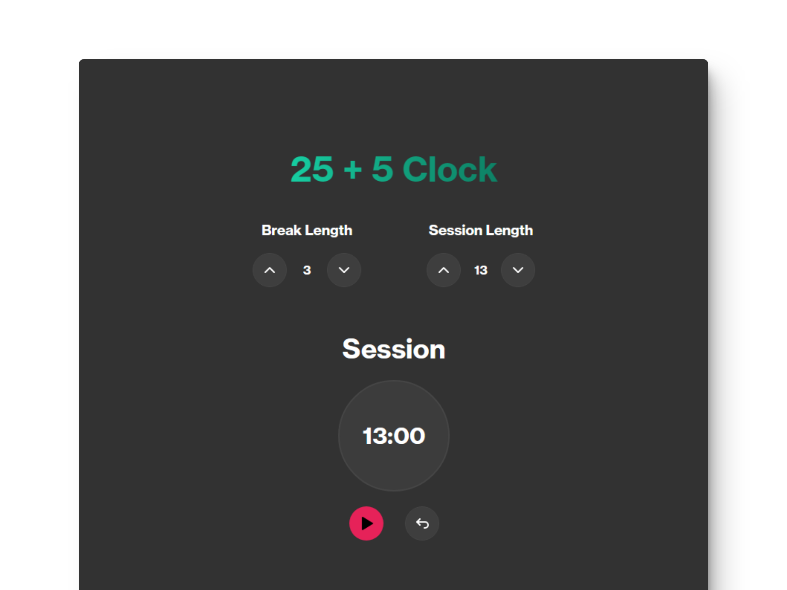

# ⏰ React: Build a 25 + 5 Clock

### Aplicación de un reloj de Pomodoro

> 🧩 Aquí puedes ver su [**Live Demo.**](https://25-5-clock-abrahamgalue.netlify.app/)

## 🚀 Descripción

Este proyecto es un **Reloj digital** que te permite utilizar la técnica de **Pomodoro** para concentrarte en tus actividades diarias.

 

## 🧞‍♂️ Especifícaciones:

**Objective:** Build an app that is functionally similar to this: https://25--5-clock.freecodecamp.rocks.

Fulfill the below user stories and get all of the tests to pass. Use whichever libraries or APIs you need. Give it your own personal style.
