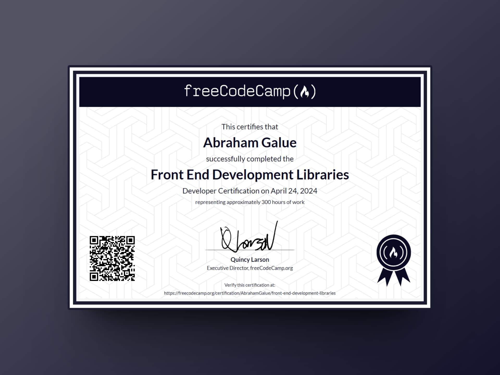

# 🔥 freeCodeCamp: Front End Development Libraries Certification

### Certificado de freeCodeCamp

> 🗝 Puedes verificar aquí la veracidad de mi [**certificado**](https://www.freecodecamp.org/certification/AbrahamGalue/front-end-development-libraries).

## 🚀 Descripción

Este es mi repositorio de proyectos con los cuales obtuve la **certificación de freeCodeCamp** en su **curso de Bibliotecas de desarrollo front-end.** Espero que te pueda ayudar.

## 🎭 Proyectos

Los **proyectos principales** para obtener el certificado y que se incluyen son:

- [Random Quote Machine](/random-quote-machine/)
- [Markdown Previewer](/markdown-preview/)
- [Drum Machine](/drum-machine/)
- [React Calculator](/react-calculator/)
- [25 + 5 Clock](/25-plus-5-clock/)
