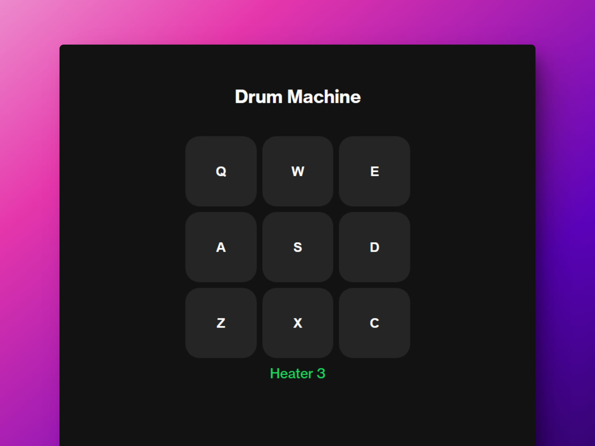

# 🎵 React: Build a Drum Machine

### Página de una máquina de percusión

> 🧩 Aquí puedes ver su [**Live Demo.**](https://drum-machine-abrahamgalue.netlify.app/)

## 🚀 Descripción

Este proyecto es una **máquina de percusión** que te permite reproducir ciertas notas con el teclado.

 

## 🧞‍♂️ Especifícaciones:

**Objective:** Build an app that is functionally similar to this: https://drum-machine.freecodecamp.rocks/.

Fulfill the below user stories and get all of the tests to pass. Use whichever libraries or APIs you need. Give it your own personal style.
