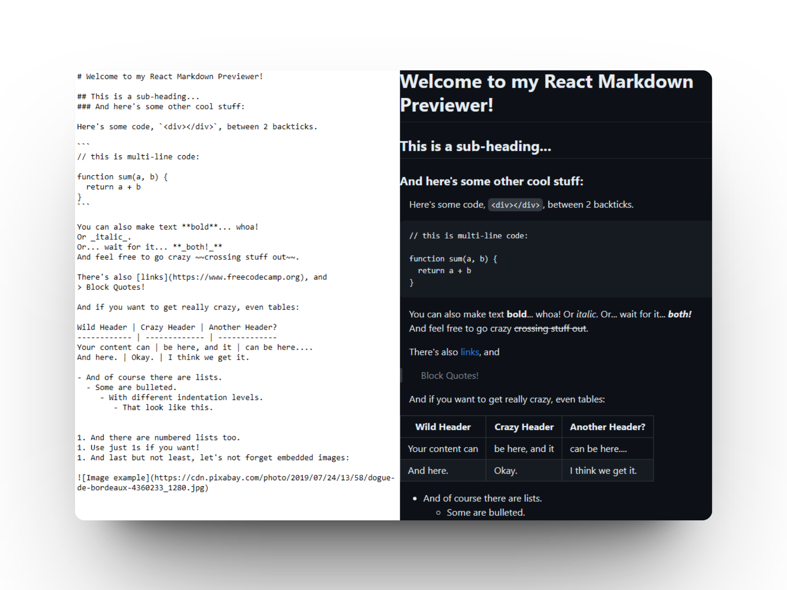

# 📄 React: Build a Markdown Previewer

### Página para la previsualización de texto markdown

> 🧩 Aquí puedes ver su [**Live Demo.**](https://markdown-preview-abrahamgalue.netlify.app/)

## 🚀 Descripción

Este proyecto es un **previsualizador de Markdown** que te permite introducir texto con formato markdown para ver como se vería este en una **página** o archivo **.md**

 

## 🧞‍♂️ Especifícaciones:

**Objective:** Build an app that is functionally similar to this: https://markdown-previewer.freecodecamp.rocks/.

Fulfill the below user stories and get all of the tests to pass. Use whichever libraries or APIs you need. Give it your own personal style.
