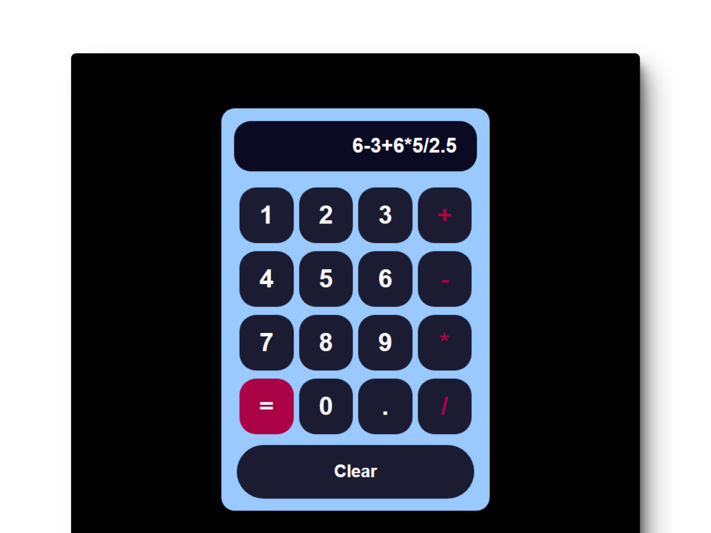

# 🔢 React: Build a JavaScript Calculator

### Aplicación de Calculadora

> 🧩 Aquí puedes ver su [**Live Demo.**](https://react-calculator-abrahamgalue.netlify.app/)

## 🚀 Descripción

Este proyecto es una **calculadora** creada con React.

 

## 🧞‍♂️ Especifícaciones:

**Objective:** Build an app that is functionally similar to this: https://javascript-calculator.freecodecamp.rocks/.

Fulfill the below user stories and get all of the tests to pass. Use whichever libraries or APIs you need. Give it your own personal style.
